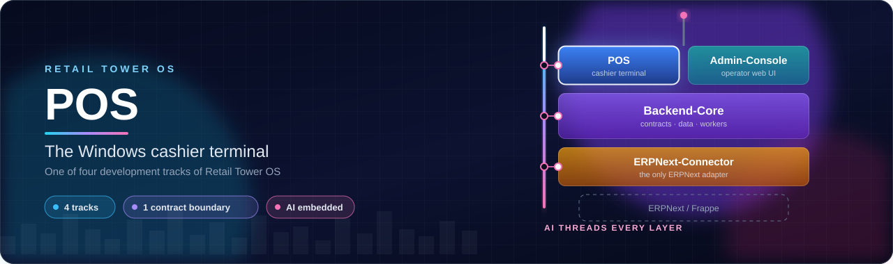
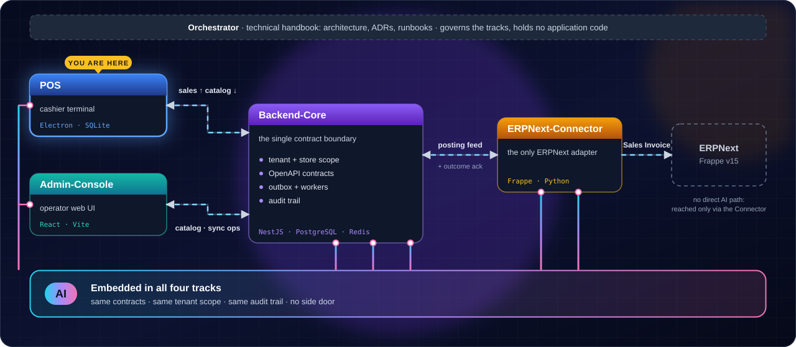
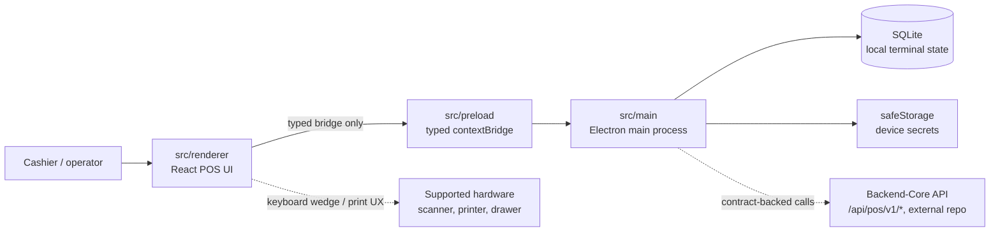

<div align="center">



<p align="center">
  <a href="docs/product.md"></a>
  <a href="#-ai-is-native-to-the-architecture-and-the-design"></a>
  <a href=".specify/memory/constitution.md"></a>
  <a href="src/shared/bridge-api.ts"></a>
  <a href="migrations"></a>
  <a href=".specify/memory/constitution.md"></a>
  <a href="LICENSE"></a>
</p>

<p align="center">
  <a href=".nvmrc"></a>
  <a href="tsconfig.json"></a>
  <a href="package.json"></a>
  <a href="src/renderer"></a>
  <a href="vite.config.ts"></a>
  <a href="tailwind.config.ts"></a>
  <a href="https://github.com/Kemetra/POS/blob/badges/loc.svg"></a>
</p>

<p align="center">
  <a href="#-one-project-four-tracks"><b>Tracks</b></a> &nbsp;·&nbsp;
  <a href="#-ai-is-native-to-the-architecture-and-the-design"><b>AI</b></a> &nbsp;·&nbsp;
  <a href="#current-implementation-status"><b>Status</b></a> &nbsp;·&nbsp;
  <a href="#integration-surfaces"><b>Sync</b></a> &nbsp;·&nbsp;
  <a href="#getting-started"><b>Get started</b></a> &nbsp;·&nbsp;
  <a href="docs/README.md"><b>Docs</b></a>
</p>

</div>

> **Retail Tower OS** is the product; this repository, [`Kemetra/POS`](https://github.com/Kemetra/POS), is its POS track: **POS Pulse** (also written POS-Pulse), the Windows cashier terminal. It contains no backend, admin frontend or ERPNext/Frappe code: those live in the sibling tracks below ([Backend-Core](https://github.com/Kemetra/Backend-Core), [Admin-Console](https://github.com/Kemetra/Admin-Console), [ERPNext-Connector](https://github.com/Kemetra/ERPNext-Connector)). The names `POS Pulse` and `SmartDataPulse` remain in use in code, packaging and docs; the legacy names Data-Pulse-2 / DP2 refer to `Kemetra/Backend-Core`.

---

## 🧩 One project, four tracks

<p align="center">
  
</p>

| Track | Repository | Owns |
| --- | --- | --- |
| **POS** ◀ you are here | [`Kemetra/POS`](https://github.com/Kemetra/POS) | Windows cashier terminal · offline state · receipts · POS ↔ Backend-Core sync |
| **Backend-Core** | [`Kemetra/Backend-Core`](https://github.com/Kemetra/Backend-Core) | APIs · data · workers · tenant/store context · sync operations |
| **Admin-Console** | [`Kemetra/Admin-Console`](https://github.com/Kemetra/Admin-Console) | Operator web UI · catalog · inventory views · sync ops |
| **ERPNext-Connector** | [`Kemetra/ERPNext-Connector`](https://github.com/Kemetra/ERPNext-Connector) | The only ERPNext/Frappe adapter · DocType mapping · posting |

<sub>One architecture, one set of contracts, one AI-embedded design. <a href="https://github.com/Kemetra/Orchestrator"><code>Kemetra/Orchestrator</code></a> is the technical handbook, not a track.</sub>

---

## 🧠 AI is native to the architecture and the design

<p align="center">
  
</p>

<table>
<tr>
<td width="25%" valign="top"><b>🔒 Same boundary</b><br/><sub>Only the typed preload bridge (<a href="src/shared/bridge-api.ts"><code>bridge-api.ts</code></a>) and Backend-Core contracts. No privileged IPC, no side door.</sub></td>
<td width="25%" valign="top"><b>🧾 Auditable</b><br/><sub>Sales, the outbox and audit events live in durable local SQLite, so AI-assisted actions can be traced and reviewed.</sub></td>
<td width="25%" valign="top"><b>🏢 Tenant-safe</b><br/><sub>No card data, secrets or PII. Each terminal stays inside its own tenant and branch scope (<a href=".specify/memory/constitution.md">constitution</a>).</sub></td>
<td width="25%" valign="top"><b>🧑‍⚖️ Human-governed</b><br/><sub>Cashier, manager and admin keep authority. Role checks and approval gates apply to AI as to a person.</sub></td>
</tr>
</table>

> AI-embedded describes the architectural and design direction. The source on `main` contains no model or LLM integration; what is shipped today is tracked in [Current implementation status](#current-implementation-status) and under [`specs/`](specs).

---

## 🔗 Synchronization with Retail Tower OS

POS Pulse is the **edge** of the platform. For business data it speaks only to Backend-Core's contracts (`/api/pos/v1/*`), never to ERPNext. The one other outbound identity call is the operator sign-in credential exchange with the identity provider (see [`src/main/operator/clerk-client.ts`](src/main/operator/clerk-client.ts)). The resolved catalogue flows **down** into a local read model for offline lookup; finalized sales are captured locally in an outbox and drained **up** to the backend.

<p align="center">
  
</p>

<p align="center"><sub>POS-Pulse synchronization: catalogue down, sales captured to the outbox and drained up. The diagram labels Backend-Core with its legacy name, Data-Pulse-2.</sub></p>

```text
POS Pulse ──▶ Backend-Core ──▶ ERPNext-Connector ──▶ ERPNext / Frappe
```

### Where POS Pulse sits in Retail Tower OS

The full five-repo ecosystem, with the control-plane band on top and POS Pulse as the highlighted **edge node**.

<p align="center">
  
</p>

<p align="center"><sub>POS-Pulse is the gold-badged node (★ THIS REPO). A live animated SVG that honors <code>prefers-reduced-motion</code>.</sub></p>

Full detail: [docs/architecture/synchronization.md](docs/architecture/synchronization.md) ·
Program technical handbook: [Orchestrator](https://github.com/Kemetra/Orchestrator).

### Integration surfaces

Every call below goes to Backend-Core under `/api/pos/v1/*`. The device token identifies the terminal; the operator envelope or identity JWT identifies the signed-in operator (see [`docs/architecture/current.md`](docs/architecture/current.md) §6).

| Purpose | Backend-Core endpoints used | Driver in `src/main` |
| --- | --- | --- |
| Terminal pairing | `terminals/pair` | `pairing/` |
| Operator sign-in, sign-out, roster, takeover | `operators/sign-in` · `operators/sign-out` · `operators/roster` · `operators/takeover/confirm` | `operator/` |
| Cashier admissions, stuck shifts | `cashier-admissions` (+ `/roster`, `/{id}/end`) · `shifts/stuck` | `operator/` |
| Catalogue read-down | `catalog/snapshot` | `catalogue/read-down/` |
| Sale capture-up | `sales` (POST, GET `{saleRef}`) | `sales-sync/` |
| Returns | `sales/{saleRef}/returns` | `returns/` |
| Shift cash-up | `shifts` | `shift-cashup/` |
| Internal vouchers (flag-gated, outside the pilot) | `vouchers/validate` · `vouchers/redeem` · `vouchers/reverse` | `payments/voucher-authority-client/` |

The OpenAPI contracts are owned by Backend-Core. This repo vendors a pinned subset in [`contracts/backend-core`](contracts/backend-core) (7 contract files, see its [`PIN`](contracts/backend-core/PIN)), and a conformance suite under [`tests/contract/backend-core`](tests/contract/backend-core) runs in CI. The generated client types in `src/shared/api-types.ts` come from [`scripts/openapi-snapshot.json`](scripts/openapi-snapshot.json).

---

## Live terminal control map

[](docs/architecture/pos-pulse-live-map.html)

Open the [interactive Three.js terminal map](docs/architecture/pos-pulse-live-map.html) through a local static server or docs host. It is backed by [topology JSON](docs/architecture/pos-pulse-live-map.json); the README stays GitHub-safe with the static SVG preview above.

---

## Repository structure flow

Every layer of POS Pulse — from the cashier's first scan to the SaaS handoff — in one animated diagram, framed by Spec Kit governance on the left and the quality and state machinery on the right.


Open [the structure flowchart](docs/assets/structure-flowchart.svg) directly for the full-resolution animated view. It traces each authenticated path: UI events into the renderer, validated payloads through the typed bridge, durable writes into SQLite, secrets through `safeStorage`, and contract-backed sync to the platform.

---

## Current implementation status

> **Source of truth.** GitHub `main` is the technical truth for what is implemented; active work and priorities are tracked in Jira (project **RT**). The `Status:` headers inside `specs/*/spec.md` were written at spec time and often lag the code, so the table below is derived from what exists on `main` (source under `src/main`, migrations, routes, feature flags), not from those headers. [`specs/README.md`](specs/README.md) is a status index with the same caveat.

The terminal is well past the foundation slices. As of the baseline below, `main` contains the full local cashier loop (pairing, operator sessions, cart, search and scan, tender, sale finalization, receipts via OS print), the two Backend-Core sync legs (catalogue read-down, sale capture-up), and flag-gated returns and shift cash-up.

| Capability | State on `main` | Gate | Spec |
| --- | --- | --- | --- |
| Secure Electron foundation (sandbox, isolation, sender-guarded IPC, single-instance lock, hardened Electron fuses) | Implemented | n/a | [`001`](specs/001-foundation) · [architecture](docs/architecture/current.md) |
| Terminal pairing, device-token binding, device revocation | Implemented | n/a | [`002`](specs/002-terminal-pairing) |
| Operator sessions: sign-in, cashier PIN and offline grants, manager PIN, roster, takeover, session lock, stuck shifts | Implemented | n/a | [`004`](specs/004-operator-session) · [`016`](specs/016-operator-envelope-adoption) · [`017`](specs/017-offline-pin-reanchor) · [`019`](specs/019-cashier-pin-provisioning) |
| POS shell and visual system; the V5 sale workspace and shift screens under `src/renderer/v5` | Implemented | n/a | [`003`](specs/003-pos-ui-shell) · [`007`](specs/007-pos-visual-system) · [`022`](specs/022-pos-ui-v4-rescue) · [`023`](specs/023-pos-ui-clean-room) · [`DESIGN.md`](docs/DESIGN.md) |
| Sales cart | Implemented | `POS_PULSE_FEATURE_CART` | [`005`](specs/005-sales-cart) |
| Product search and barcode lookup over the local read model | Implemented | `POS_PULSE_FEATURE_PRODUCT_SEARCH` | [`009`](specs/009-product-search-and-barcode-lookup) |
| Catalogue read-down from Backend-Core (`catalog/snapshot`) into local SQLite | Implemented | n/a | [`010`](specs/010-pos-catalog-read-down-consumption) |
| Payments tender: cash and external card terminal (recorded, never captured) | Implemented | `POS_PULSE_FEATURE_PAYMENTS` (requires sale finalization) | [`006`](specs/006-payments-tender) |
| Internal voucher tender | Implemented; outside the pilot | `POS_PULSE_FEATURE_VOUCHER_TENDER` | tracked in Jira RT |
| Sale finalization and receipts via OS print. Direct ESC/POS printing and cash-drawer kick are **not wired**: the ESC/POS path is a stub that is never selected, and the drawer transport always reports `no_drawer_configured` (a cash sale records a failed drawer row) | Implemented for OS print only; **sale-level tax is hardcoded to 0, so customer-facing fiscal use is blocked** | `POS_PULSE_FEATURE_SALE_FINALIZATION` | [`008`](specs/008-sale-finalization-and-receipts) |
| Sale capture-up: outbox, drain engine, idempotent retry, dead-letter | Implemented and wired in the composition root; live end-to-end validation is tracked separately | n/a | [`011`](specs/011-sale-sync-capture-up) |
| Returns (manager/admin, `/app/returns`) | Implemented | `POS_PULSE_FEATURE_RETURNS` | tracked in Jira RT |
| Shift cash-up (open, pay-in/out, blind-count close, manager approval) and its sync | Implemented | `POS_PULSE_FEATURE_SHIFT_CASHUP` | tracked in Jira RT |
| Dashboard, audit, inventory, and settings screens | Navigation placeholders only | n/a | n/a |
| Local audit events | Implemented locally; the audit sync module exists but is not wired into the app | n/a | [`004`](specs/004-operator-session) |
| Egyptian VAT and fiscal receipt | Not implemented | n/a | [`012`](specs/012-vat-fiscal-receipt) (seed only) |
| Inventory awareness | Not implemented | n/a | [`013`](specs/013-inventory-awareness) (seed only) |
| Credit and third-party tender, insurance co-pay | Not implemented | n/a | [`020`](specs/020-pos-credit-and-third-party-tender-flow) · [`0xx`](specs/0xx-insurance-copay) (spec only) |
| Cashier flow state machine and smoke contract | Not implemented | n/a | [`018`](specs/018-pos-cashier-flow-state-machine-and-smoke-contract) (spec only) |
| Any AI-driven feature | None on `main` | n/a | see [AI is native to the architecture and the design](#-ai-is-native-to-the-architecture-and-the-design) |

All feature flags are fail-closed: each is read from its `POS_PULSE_FEATURE_*` environment variable and defaults to off ([`src/main/app/feature-flags.ts`](src/main/app/feature-flags.ts)). A route that shows a placeholder usually means its flag is off.

**Baseline for this table:** `origin/main` at `6ea6ce0` (2026-10-08), 44 SQL migrations (`migrations/0001`–`0044`), 697 test files (`*.test.ts[x]`), 7 vendored Backend-Core contract files, 24 spec folders (`001`–`023` plus `0xx-insurance-copay`). Re-verify against `main` before relying on it. The pilot terminal profile and readiness check are in [`docs/runbook/pilot-terminal-provisioning.md`](docs/runbook/pilot-terminal-provisioning.md).

---

## What you can verify today

| Claim | Repo-backed evidence |
| --- | --- |
| Renderer cannot reach Node/Electron directly | [preload bridge](src/preload) · [bridge API](src/shared/bridge-api.ts) |
| High-trust work stays in Electron main | [main process](src/main) · [constitution](.specify/memory/constitution.md) |
| Money avoids floating point | [shared money code](src/shared) · [constitution](.specify/memory/constitution.md) |
| Local terminal state is migration-backed | [SQLite migrations](migrations) |
| Hardware scope is intentionally narrow | [hardware matrix](docs/hardware-matrix.md) |
| Backend/API source of truth is external | [API snapshot](scripts/openapi-snapshot.json) · [constitution](.specify/memory/constitution.md) |
| POS calls match Backend-Core contracts | [vendored contracts](contracts/backend-core/PIN) · [conformance suite](tests/contract/backend-core) |
| POS never talks to ERPNext | [current architecture](docs/architecture/current.md) · [synchronization](docs/architecture/synchronization.md) |
| Work is issue-governed; `main` is the technical truth | [`CLAUDE.md`](CLAUDE.md) · [constitution](.specify/memory/constitution.md) |

---

## Why this exists

Pharmacy checkout needs a terminal that feels fast to cashiers and boringly safe to operators. **POS Pulse keeps high-trust work in the Electron main process, keeps the renderer behind a typed preload bridge, and treats local terminal state as operationally important — not incidental UI cache.**

The backend SaaS platform lives outside this repository. POS Pulse consumes its contracts and keeps local terminal behavior secure, observable, and offline aware.

> **Success metric.** A cashier completes a sale, prints a receipt, and opens the drawer in under 10 seconds — with every transaction durably recorded and attributable to a named operator at a specific terminal, regardless of network state.

---

## Capabilities

<table>
<tr>
<td width="33%" align="center" valign="top">
  <br/>
  <strong>Secure Electron boundary</strong><br/>
  <sub><code>contextIsolation</code>, sandboxing, and a typed preload bridge keep renderer code away from Node APIs.</sub>
</td>
<td width="33%" align="center" valign="top">
  <br/>
  <strong>Terminal pairing</strong><br/>
  <sub>Device identity and branch scope are established through explicit pairing flows.</sub>
</td>
<td width="33%" align="center" valign="top">
  <br/>
  <strong>Operator sessions</strong><br/>
  <sub>Cashier, manager, and admin access is enforced through local session and role surfaces.</sub>
</td>
</tr>
<tr>
<td align="center" valign="top">
  <br/>
  <strong>Local durability</strong><br/>
  <sub>SQLite migrations preserve terminal state and audit/event records predictably.</sub>
</td>
<td align="center" valign="top">
  <br/>
  <strong>Audit &amp; redaction</strong><br/>
  <sub>Logs and audit events avoid PII, cards, secrets, and unsafe payloads.</sub>
</td>
<td align="center" valign="top">
  <br/>
  <strong>Hardware discipline</strong><br/>
  <sub>Windows x64, keyboard-wedge scanners, receipt printers, and optional cash drawers — intentionally narrow.</sub>
</td>
</tr>
</table>

---

## Terminal architecture

POS Pulse is an Electron 44 + React 19 + Vite 8 application. The app is split across the Electron main process, a typed preload bridge, the renderer, local SQLite, and generated API types from the Backend-Core platform contract. [`docs/architecture/current.md`](docs/architecture/current.md) is the canonical reference for the internal architecture.




---

## End-to-end transaction flow

A sale travels through every process boundary — and never crosses one without a contract.


| Step | Lane | What happens |
| :--: | --- | --- |
| **1** | Renderer | Cashier scans an SKU; React cart state updates in minor-unit money. |
| **2** | Preload | The typed `contextBridge` contract validates the call payload. |
| **3** | Main | Money invariants (integer minor units) and the payment state machine check the transaction before any state mutates. |
| **4** | Main | One atomic finalize transaction re-checks idempotency, allocates the sale number, and writes the sale and its pending outbox entry. |
| **5** | Main | A redacted audit event is emitted in the same transaction. PII, card, and secret fields are stripped. Printing is dispatched after the commit, never inside it. |
| **6** | Backend-Core | When online, the sale-sync engine drains the outbox with an idempotent, contract-backed `POST /api/pos/v1/sales`. Offline, the sale simply waits in the outbox. |

---

## Repository map

| Path | Purpose |
| --- | --- |
| `src/main` | Electron main process · composition root (`index.ts`) · SQLite and migrations runner · pairing · operator sessions and PINs · cart · catalogue read-down · payments · sale finalization · receipts and drawer · sale sync · returns · shift cash-up · audit · logging · secrets · IPC handlers · observability |
| `src/preload` | Typed preload bridge exposed through `contextBridge` |
| `src/renderer` | React + Vite renderer · shell and V5 frame · routes · sale, checkout, returns and shift surfaces · UI primitives · design tokens |
| `src/shared` | Shared types · money utilities · generated API types · audit schemas · bridge contracts · pairing types · operator roles |
| `migrations` | 44 versioned SQLite migration files (`0001`–`0044`) applied by the local migration runner |
| `contracts/backend-core` | Pinned subset of Backend-Core's OpenAPI contracts, vendored for the conformance suite |
| `tests` | Contract, integration and unit coverage outside process-local source test folders |
| `specs` | Spec Kit artifacts, `001`–`023` plus `0xx-insurance-copay`: design records, not the authority for current behavior (see [`specs/README.md`](specs/README.md)) |
| `docs` | Documentation index · current architecture · hardware matrix · product · design system and RT-104 VNext package · runbooks · assets |
| `scripts` | OpenAPI codegen and verification · contract re-pin · dev-electron launcher · perf seed · LOC badge automation |
| `.specify` | Spec Kit infrastructure · constitution v1.5.1 · templates |
| `.github` | CI workflow (static, test, Windows package, docs fast path) · PR template · CODEOWNERS |

### What this repo owns
The Windows 10/11 x64 Electron cashier terminal: cashier workflow · secure process boundaries and the typed preload bridge · local and offline state (SQLite, outbox) · receipt behavior · barcode and product search · payment interaction · POS ↔ Backend-Core synchronization · pairing, operator sessions, audit, logging · POS UI primitives and design tokens · MVP hardware compatibility docs.

### What this repo does **not** own
Backend-Core (APIs, database, workers, and the OpenAPI source of truth: [`Kemetra/Backend-Core`](https://github.com/Kemetra/Backend-Core)) · the admin/operator frontend ([`Kemetra/Admin-Console`](https://github.com/Kemetra/Admin-Console)) · any ERPNext/Frappe call or mapping ([`Kemetra/ERPNext-Connector`](https://github.com/Kemetra/ERPNext-Connector) is the only ERPNext adapter; POS must never call ERPNext directly) · broad hardware compatibility outside the MVP matrix · PCI card-terminal integration or direct card capture.

---

## Tech stack

| Layer | Stack |
| --- | --- |
| Desktop runtime | Electron 44 · Windows 10/11 x64 target |
| Renderer | React 19 · Vite 8 · Tailwind 4 · React Router 7 · Zustand · TanStack Query |
| Language | TypeScript 5 strict mode |
| Local data | `better-sqlite3` · SQL migrations |
| Security | Electron sandbox · context isolation · typed preload bridge · `safeStorage` · argon2 PIN hashing · Electron fuses |
| Hardware | Keyboard-wedge scanner · receipt printing through the OS print path (direct ESC/POS via `node-thermal-printer` is a stub, not selected) · cash-drawer kick is designed but not wired (the transport reports `no_drawer_configured`) |
| Observability | pino · Sentry Electron |
| Contracts | Pinned OpenAPI snapshot via `openapi-typescript` · vendored Backend-Core contracts · conformance suite |
| Testing | Vitest · Testing Library · happy-dom · axe-core · sql.js |
| Packaging | electron-builder unsigned Windows directory build |

---

## Getting started

**Prerequisites.** Node.js 20+ (`.nvmrc` pins 20; CI runs Node 24) · npm with the committed `package-lock.json` · Windows 10/11 x64 for the target runtime and the package dry-run.

```bash
npm install            # install dependencies (postinstall rebuilds better-sqlite3 for Electron)
npm run dev            # run Vite + Electron together
npm run build          # build renderer, preload and main
npm run typecheck      # renderer, main and preload tsconfigs
npm run lint           # eslint + prettier --check
npm test               # vitest run
npm run package:dir    # electron-builder --win --dir (unsigned)
```

**Runtime configuration.** Set `VITE_API_BASE_URL` to the Backend-Core host; unset, it deliberately fails closed. Cashier surfaces are controlled by the fail-closed `POS_PULSE_FEATURE_*` flags (see [Current implementation status](#current-implementation-status)). How a packaged pilot terminal receives its settings is in the [pilot terminal provisioning runbook](docs/runbook/pilot-terminal-provisioning.md).

**Codegen and contracts.** Codegen uses the pinned OpenAPI snapshot; the vendored Backend-Core contracts are re-pinned explicitly.

```bash
npm run codegen:api       # regenerate src/shared/api-types.ts
npm run codegen:verify    # CI helper: regen → diff
npm run contracts:repin   # re-vendor contracts/backend-core from Backend-Core
```

---

## Documentation

| Audience | First reads |
| --- | --- |
| **Product & operations** | [Product brief](docs/product.md) · [Hardware matrix](docs/hardware-matrix.md) · [POS shell spec](specs/003-pos-ui-shell/spec.md) |
| **Engineering** | [Current architecture](docs/architecture/current.md) · [Spec status index](specs/README.md) · [Foundation quickstart](specs/001-foundation/quickstart.md) · [Pairing quickstart](specs/002-terminal-pairing/quickstart.md) · [Operator session plan](specs/004-operator-session/plan.md) · [Live terminal map](docs/architecture/pos-pulse-live-map.html) |
| **Design** | [Design system](docs/DESIGN.md) · [Visual system spec](specs/007-pos-visual-system/spec.md) |
| **Security** | [Constitution](.specify/memory/constitution.md) · [Operator security review](specs/004-operator-session/security-review/s1-review.md) |
| **Integration** | [Pairing HTTP contract](specs/002-terminal-pairing/contracts/pairing-http.md) · [Operator bridge contract](specs/004-operator-session/contracts/bridge-api.md) · [Synchronization](docs/architecture/synchronization.md) · [Pinned Backend-Core contracts](contracts/backend-core/PIN) · [API snapshot](scripts/openapi-snapshot.json) |

Full navigation lives in [docs/README.md](docs/README.md). Operational playbooks live in [docs/runbook](docs/runbook) (payments, sale finalization, catalogue read-down, product search, sales cart, pilot terminal provisioning, security review).

---

## Development agreement

POS Pulse follows the [constitution](.specify/memory/constitution.md) and the repo operating instructions in [`CLAUDE.md`](CLAUDE.md). The unit of work is a Jira issue (project RT); GitHub `main` is the technical truth. Start from `origin/main`, keep changes to the issue's scope, test first, preserve the secure Electron boundaries, avoid unsafe logging, and do not change dependency manifests, lockfiles, migrations, CI workflows, or security posture without explicit approval. The Spec Kit flow is used to author specs within an issue; the former Maestro and queue-dispatch workflow (`docs/maestro`) is historical reference only.

<div align="center">
<sub>Precise · accountable · unhurried.</sub>
</div>
